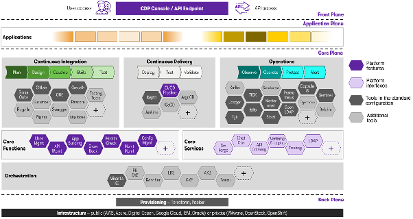

# Architettura dell'ambiente centralizzato di sviluppo sicuro

## Panoramica

L'architettura dell'ambiente centralizzato di sviluppo sicuro si basa su GitLab come piattaforma centrale per la gestione del codice sorgente e la collaborazione tra i team di sviluppo. Questa soluzione è integrata con una robusta pipeline di Continuous Integration/Continuous Deployment (CI/CD) e strumenti di analisi della sicurezza e della qualità del codice. L'accesso all'ambiente è strettamente controllato attraverso connessioni VPN e, ove opportuno, autenticazione multi-fattore.

## Componenti principali

GitLab funge da repository centralizzato per tutto il codice sorgente dell'Amministrazione. Offre funzionalità di gestione del codice, code review, issue tracking e wiki per la documentazione del progetto. Integrata direttamente in GitLab è presente una pipeline CI/CD automatizza i processi di build, test e deployment del codice. Questa componente è cruciale per garantire la qualità e la sicurezza del codice attraverso controlli automatizzati ad ogni commit o merge request.

La Container DevSecOps Platform (CDP) è una piattaforma di automazione di sviluppo, test, deployment ed analisi statiche, ottenuta integrando diverse componenti software open-source tra di loro. All'interno di questa piattaforma è integrato anche un sistema di gestione delle identità e degli accessi (IAM) che supporta l'autenticazione multi-fattore e l'integrazione con sistemi Single Sign-On (SSO) esistenti.

È previsto l'accesso degli utenti all'ambiente tramite una VPN che consente agli sviluppatori di raggiungere gli ambienti di test, GitLab, ed il pannello della CDP per verificare lo stato dei container/pod ed i log applicativi.

### Deploy e CDP

Le procedure di deploy sono gestite attraverso pipeline GitLab e CDP, che integrano vari livelli di controllo qualità e sicurezza. Ogni deploy include fasi di build, test automatizzati (compresi i test di sicurezza), e il deploy effettivo delle componenti e dei database. Le strategie di rollback e i piani di recovery sono parte integrante del processo di deploy, assicurando la possibilità di tornare rapidamente a una versione stabile in caso di problemi.

Gli artifact prodotti dalle pipeline sono persistiti su istanze Nexus (librerie e file) e Harbor (container), che possono essere consultati liberamente dagli sviluppatori. Le automazioni della CDP utilizzano questi due sistemi, principalmente Harbor, come origine per il deploy dei container sui cluster Kubernetes in gestione.

All'interno del GitLab è contenuto un repository dedicato alla storicizzazione dei manifest Kubernetes e degli Helm chart per il deploy dei servizi, in ossequio al paradigma Infrastructure-as-Code (IaC). A questo repository tutti gli sviluppatori hanno accesso come developer, mentre gli amministratori dell'infrastruttura Kubernetes hanno accesso come maintainer. In questo modo possono mantenere le pipeline di deploy e raccordare con continuità le fasi di sviluppo a quelle di attivazione della produzione.

## Altri sistemi coinvolti

L'ambiente centralizzato di sviluppo sicuro è composto oltre che da GitLab e dalla CDP anche da altri sistemi e servizi la cui integrazione di repository è necessaria per garantire un flusso di lavoro continuo ed efficiente.

### Identity and Access Management

Per la gestione degli accessi, GitLab si integra con LDAP, che a sua volta è utilizzato anche da un'istanza KeyCloak per gli altri software del sistema, centralizzando la gestione delle identità e dei permessi.

All'interno di LDAP sono censiti gli applicativi, mentre i permessi di accesso ai gruppi sono configurati in KeyCloak.

Questa integrazione permette una gestione unificata degli utenti e facilita l'implementazione di politiche di sicurezza.

### Monitoraggio e Logging

Il sistema include l'integrazione con strumenti di monitoraggio Elasticsearch e Kibana, che permettono di visualizzare e analizzare i log delle applicazioni.

Rancher e Prometheus/Grafana sono utilizzati per il monitoraggio dell'infrastruttura, assicurando che le metriche operative siano sempre sotto controllo.

Gli sviluppatori accedono normalmente ai log all'interno di Elasticsearch e Kibana, mentre le metriche raccolte sull'infrastruttura rimangono accessibili normalmente solo al personale dedicato all'area operations.

Sono disponibili documenti specifici sulle funzionalità e strutture di monitoraggio e logging centralizzato.

### Test e Analisi del Codice

L'ambiente è configurato per utilizzare container Docker per ambienti di test isolati e consistenti, anche se si raccomanda l'uso di database ed altri servizi in-memory per ridurre la complessità di esecuzione dei test stessi, aumentando le prestazioni. I test automatizzati e la raccolta delle metriche da essi, gestiti tramite strumenti appositi, sono parte integrante della pipeline CI/CD, garantendo che il codice rilasciato sia di alta qualità e sicuro.

Altri strumenti specifici sono utilizzati per l'analisi delle dipendenze, assicurando che tutte le librerie ed i framework utilizzati siano aggiornati e sicuri. Le verifiche delle dipendenze sono integrate nella pipeline CI/CD per garantire che ogni modifica al codice venga valutata in termini di sicurezza delle dipendenze.

Sono disponibili documenti specifici sulle procedure di test automatico delle funzionalità e sulle procedure di verifica statica della sicurezza del codice.
