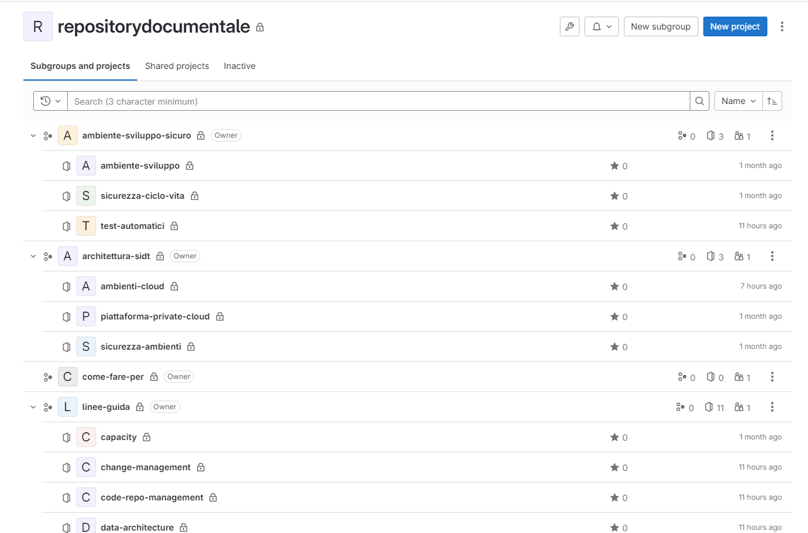
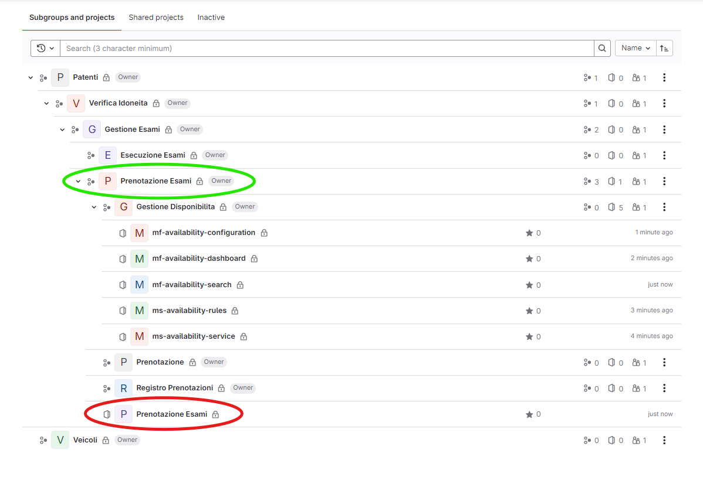

# Struttura della Documentazione

Per garantire una gestione efficiente della documentazione tecnica, è fondamentale adottare una struttura chiara e ben organizzata. Questo capitolo descrive come organizzare i file di documentazione nel repository, quali convenzioni utilizzare per la loro nomenclatura e quali linee guida seguire nella creazione e strutturazione dei singoli documenti.

## Tipologie di documentazione tecnica e sua gestione

Nel panorama complesso del  **Sistema Informativo del Dipartimento Trasporti (SIDT)** , esistono diversi tipi di documentazione, ciascuno con scopi specifici e destinatari differenti, che devono essere gestiti con approcci adattati al contesto, ma seguendo, per quanto possibile, modalità operative analoghe. Questa articolazione riflette la necessità di garantire coerenza, chiarezza e aggiornamenti continui nella documentazione, pur rispondendo a esigenze diverse in base al tipo di contenuto e all'artefatto che viene documentato.

Parallelamente alla documentazione di seguito descritta, esiste anche una documentazione legata agli  **aspetti formali del contratto**, ai sensi del Codice degli Appalti e della disciplina di gara, che viene gestita al di fuori della piattaforma e include documenti legali, accordi contrattuali e clausole specifiche, report e documentazione formale a comprova dell'avvenuta esecuzione delle prestazioni e della loro correttezza, nonché la documentazione prodotta dall'Amministrazione, dal RUP, dal DEC e da eventuali Commissioni di Verifica di Conformità.

### Documentazione Generale

La **documentazione generale** riguarda gli aspetti strutturali e metodologici che si applicano all'intero ecosistema del SIDT. Questa include, ad esempio:

* **Linee guida per lo sviluppo applicativo**: Raccomandazioni e regole che definiscono le pratiche standard per lo sviluppo e la manutenzione del software.
* **Linee guida per la sicurezza**: Policy e pratiche di sicurezza che devono essere implementate durante lo sviluppo e la manutenzione del software.
* **Descrizione delle architetture di riferimento**: Un quadro di riferimento generale che descrive l'architettura del sistema e le interazioni tra i diversi componenti.
* **Linee guida sulla data architecture**: Best practice e standard per la gestione dei dati, dalla modellazione alla governance.
* **Linee guida per la DevSecOps e la CI/CD**: Direttive operative per l'implementazione delle pratiche DevSecOps e l'automazione dei flussi di lavoro CI/CD

Questa documentazione ha un carattere più trasversale, fornendo indicazioni che devono essere seguite in tutto il ciclo di vita del software. Data la sua importanza strategica, richiede particolare attenzione nella sua manutenzione e revisione.

Questo tipo di documentazione è archiviata in progetti dedicati all'interno di GitLab articolati per singolo documento all'interno di una struttura di gruppi ordinata. Questo consente una gestione granulare dei permessi e dei workflow approvativi. Nella seguente figura è rappresentata a titolo di esempio l'articolazione dei gruppi e dei progetti:



Figura 1 - Esempio di organizzazione dei gruppi e dei repository per la gestione della Documentazione Generale

### Documentazione Tecnica di Prodotto

La **documentazione tecnica di prodotto** è specifica per ciascuna applicazione o sistema e fornisce una descrizione dettagliata delle sue caratteristiche tecniche.

Tra i documenti più comuni, in un approccio waterfall, troviamo:

* **Software Requirements Specification (SRS)**: Definisce chiaramente i requisiti funzionali e non funzionali di un prodotto software, individuati nelle fasi iniziali di analisi e progettazione.
* **Software Design Description (SDD)**: Descrive l'architettura ed il design di un'applicazione o di un sistema, con approfondimenti sui componenti chiave e sulle loro interazioni, ed include le scelte di architettura, le decisioni progettuali, i modelli e i paradigmi, sia ad alto livello che in dettaglio.
* **Test Plan e Test Case Documentation**: Dettagliano il piano di test del prodotto software per la verifica della rispondenza ai requisiti funzionali e non funzionali.
* **Guida all'Installazione e alla Configurazione**: Fornisce le istruzioni passo-passo per l'installazione e la configurazione del prodotto in vari ambienti (ad esempio, sviluppo, test, produzione).
* **Manuali d'uso e di gestione**: Forniscono le istruzioni per l'uso della soluzione applicativa da parte degli utenti e per la sua gestione da parte del personale specializzato.

In un approccio Agile, invece, la documentazione viene gestita in modo iterativo e deve pertanto essere più snella, concentrandosi su ciò che è necessario per supportare lo sviluppo incrementale e il valore immediato per l'Amministrazione. I principali documenti tecnici in questo modello di sviluppo sono:

* **Scheda Progetto (Product Vision)**

  * **Descrizione**: Un documento ad alto livello che descrive la visione strategica del prodotto, gli obiettivi di business e il valore che si intende creare per gli utenti. Definisce in modo sintetico lo scopo del prodotto, chi sono gli utenti principali e quali problemi risolve.
  * **Utilizzo**: Viene utilizzato come guida per il team di sviluppo per mantenere il focus sul valore a lungo termine e sugli obiettivi di business.
  * **Frequenza di aggiornamento**: Viene definito nella fase di Inception del prodotto e può essere rivisitato occasionalmente per allinearsi alle evoluzioni della normativa o delle esigenze.
* **Product Backlog**

  * **Descrizione**: Una lista prioritaria e dinamica delle funzionalità, miglioramenti e correzioni necessarie per il prodotto. Ogni elemento del backlog (Product Backlog Item o PBI) descrive una funzionalità, una richiesta o un requisito a livello sufficientemente dettagliato da permettere al team di stimare il lavoro necessario.
  * **Utilizzo**: Serve come base per la pianificazione degli sprint, con il Product Owner che aggiorna e riprioritizza il backlog in base al feedback del team e degli stakeholder.
  * **Frequenza di aggiornamento**: Continuamente, man mano che emergono nuovi requisiti o il business cambia.
* **User Stories**

  * **Descrizione**: Descrivono le funzionalità del prodotto dal punto di vista dell'utente finale. Ogni User Story segue il formato "Come [ruolo], voglio [obiettivo] così che [beneficio]" e include criteri di accettazione che specificano cosa deve essere implementato per considerare la storia "completa".
  * **Utilizzo**: Le User Stories guidano lo sviluppo incrementale. Vengono utilizzate nei planning degli sprint per suddividere il lavoro e fornire valore in piccoli incrementi.
  * **Frequenza di aggiornamento**: Le User Stories vengono create e aggiornate in modo iterativo e continuo.
* **Definition of Done (DoD)**:

  * **Descrizione**: Definisce i criteri che devono essere soddisfatti affinché un elemento del backlog (ad esempio, una User Story) sia considerato "completato". Include aspetti come il testing, la documentazione, la revisione del codice e la conformità agli standard di qualità.
  * **Utilizzo**: Il DoD assicura che tutte le User Stories consegnate siano di alta qualità e completamente pronte per l'uso o la distribuzione.
  * **Frequenza di aggiornamento**: Viene rivisitato periodicamente e aggiornato secondo le esigenze del team.
* **Sprint Backlog**

  * **Descrizione**: Una selezione di elementi del Product Backlog che il team si impegna a completare durante uno sprint.
  * **Utilizzo**: Il team di sviluppo usa lo Sprint Backlog per pianificare e monitorare il progresso durante lo sprint, adattando il lavoro in corso se necessario.
  * **Frequenza di aggiornamento**: Viene creato e aggiornato all'inizio di ogni sprint.
* **Technical Design Documents**

  * **Descrizione**: Documenti di design snelli che descrivono l'architettura e le decisioni di design principali per nuove funzionalità o modifiche significative al sistema.
  * **Utilizzo**: Usato per facilitare la comunicazione tra i membri del team e garantire che le decisioni architetturali siano condivise e comprese.
  * **Frequenza di aggiornamento**: Creati e aggiornati su base incrementale, in base alle necessità dello sprint.
* **Architecture Decision Records (ADR)**

  * **Descrizione**: Brevi documenti che descrivono importanti decisioni architetturali prese durante lo sviluppo. Ogni ADR include il contesto della decisione, le opzioni considerate, la decisione finale e le sue conseguenze a lungo termine.
  * **Utilizzo**: Permette di tracciare le scelte architetturali in modo trasparente e di condividerle con il team, mantenendo la coerenza nell'implementazione delle nuove funzionalità.
  * **Frequenza di aggiornamento**: Creati e aggiornati ogni volta che vengono prese decisioni architetturali significative.
* **Sprint Meeting Report**:

  * **Descrizione**: Documenti che riassumono le decisioni assunte durante i meeting legati alla gestione degli sprint (Planning, Review, Retrospective).
  * **Utilizzo**: Tracciano le decisioni prese, le difficoltà incontrate, le soluzioni adottate e le lezioni apprese, favorendo il miglioramento continuo di prodotto e di processo.
  * **Frequenza di aggiornamento**: Vengono creati in corrispondenza ai relativi incontri in ogni sprint.

Questa tipologia di documentazione è fondamentale per lo sviluppo e il mantenimento di ciascun prodotto e richiede un approccio più mirato, orientato all'implementazione e all'evoluzione del singolo sistema.

In questo caso la documentazione deve essere archiviata nel progetto GitLab utilizzato per gestire la raccolta dei requisiti e la pianificazione delle attività di business. Questo progetto è collocato nel gruppo che identifica il prodotto e che contiene i sottogruppi dei diversi sottodomini di business dove vengono archiviati i progetti con il codice sorgente dei diversi microservizi e microfrontend.


Figura 2 - Esempio di organizzazione dei gruppi e dei repository per la gestione della Documentazione Tecnica di Prodotto

### Documentazione di Gestione delle Attività

La **documentazione di gestione delle attività** è strettamente legata agli strumenti di **Project Management.**  Essa include documenti come:

* **Piani di progetto**: Le tempistiche, le risorse e le milestone definite per il rilascio delle funzionalità.
* **Stato di avanzamento**: Report e aggiornamenti sull'evoluzione del progetto, allineati agli strumenti di tracciamento delle attività e ai sistemi di issue tracking della piattaforma.

Questa tipologia di documentazione è fondamentale per garantire la trasparenza delle attività di sviluppo e di implementazione e la produzione di evidenze a supporto della rendicontazione. La piattaforma di sviluppo e automazione fornisce strumenti concepiti per la gestione Agile delle attività di sviluppo.

Questa documentazione deve essere archiviata all'interno del progetto che ospita la documentazione tecnica di prodotto.

### Documentazione Tecnica della Componente

A livello più granulare, la **documentazione tecnica della componente** riguarda artefatti specifici come microservizi, microfrontend, componenti infrastrutturali nel paradigma IaC o altri componenti indipendenti del sistema. Tra gli esempi più comuni troviamo:

* **Descrizione di un'API** : Documenti che illustrano il funzionamento di una singola API, con dettagli sui metodi, parametri, codici di errore e risposte e le modalità di integrazione.
* **Documentazione per un microservizio o microfrontend** : Descrive la struttura logica, il comportamento e l'integrazione di una componente applicativa specifica all'interno dell'architettura complessiva.
* **Documentazione di un componente infrastrutturale**: Descrive il comportamento e la configurazione di un componente infrastrutturale gestito secondo il paradigma IaC.

Questa documentazione è aggiornata insieme al codice stesso, seguendo il paradigma  **Documentation as Code** , e richiede una gestione accurata tramite strumenti di versioning e automazione per rimanere sincronizzata con lo sviluppo del software.

Questa documentazione viene archiviata nel progetto GitLab a cui fa riferimento, contestualmente al codice sorgente.

### Necessità di Best Practice per la Documentazione

Questa articolazione della documentazione tecnica evidenzia la necessità di definire delle **best practice** che siano applicabili ai diversi tipi di documentazione, mantenendo una gestione coerente e integrata.

Sebbene le tipologie di documentazione possano variare, le modalità di gestione e mantenimento possono seguire principi comuni, quali la coerenza nella struttura, l'uso di strumenti di version control, l'automazione della validazione, e l'integrazione nei flussi di sviluppo.

Definire delle best practice per ogni contesto specifico permette di ottimizzare la qualità e la manutenibilità della documentazione, assicurando che rimanga allineata alle esigenze del progetto e del team.

## Organizzazione dei file di documentazione

Per mantenere la documentazione accessibile e ben strutturata, è necessario organizzare i file in una gerarchia logica all'interno del repository. Questo approccio facilita la navigazione tra i documenti, garantendo che ogni file sia facilmente individuabile e collegato al contesto giusto.

### Linee guida per l'organizzazione della documentazione:

1. **Cartella `/docs`**: Creare una directory `/docs` nella root del repository, dedicata esclusivamente alla documentazione. Questa convenzione viene utilizzata dagli strumenti di generazione e pubblicazione della documentazione e non deve essere disattesa.
2. **File** **`mkdocs.yml`**: Creare un file nella root del repository per gestire la generazione dei contenuti nei diversi formati e l'organizzazione dei diversi file (il file di esempio riferito alla presente documentazione è reperibile [qui](template/mkdocs.yml)).
3. **File** **`catalog-info.yaml`**: Creare un file nella root del repository per gestire la pubblicazione su Backstage (il file di esempio riferito alla presente documentazione è reperibile [qui](template/catalog-info.yaml)).
4. **File** **`/docs/index.ms`**: Creare un file nella directory `/docs` del repository per gestire la pubblicazione su Backstage. Questa pagina è la pagina di accesso alla documentazione in Backstage e, pertanto, è differente per le diverse tipologie di documentazione

   * **Documentazione Generale**: rappresenta l'introduzione del documento e informa l'utente circa lo scopo ed i destinatari del documento medesimo, oltre ad introdurre i concetti fondamentali.
   * **Documentazione Tecnica di Prodotto**: indirizza l'utente nella navigazione nei diversi artefatti documentali del prodotto.
   * Documentazione di Gestione delle Attività: la documentazione di gestione delle attività non dispone di una propria pagina di accesso poiché è gestita contestualmente alla Documentazione tecnica di prodotto.
   * **Documentazione Tecnica della Singola Componente**: indirizza l'utente nella navigazione nei diversi artefatti documentali della singola componente.
5. **Sottocartelle logiche**: Organizzare la documentazione in sottocartelle in base al contenuto, ad esempio:

   * **/doc/guide**: Per le guide utenti o amministrative.
   * **/doc/api**: Per la documentazione delle API del progetto.
   * **/doc/tutorials**: Per guide passo-passo e tutorial pratici.
6. **File README.md**: Mantenere un file `README.md` nella root del repository o all'interno della cartella `/docs` che funga da indice per tutta la documentazione. Questo file dovrebbe fornire una panoramica del contenuto e link ai file principali.
7. **Documenti per singoli argomenti**: Suddividere la documentazione in file separati per argomento. Ad esempio, ogni API dovrebbe avere un proprio file dedicato, così come ogni guida utente. In caso di documenti lunghi, ad esempio

## Convenzioni per la nomenclatura dei file

Una corretta nomenclatura dei file è essenziale per garantire coerenza, chiarezza e facilità di ricerca all'interno della documentazione. L'utilizzo di nomi descrittivi e uniformi permette di identificare rapidamente il contenuto del file senza doverlo aprire.

### Linee guida per la nomenclatura:

1. **Utilizzare il minuscolo e separatori di underscore (`_`)**:

   - Evitare spazi e lettere maiuscole nei nomi dei file.
   - Utilizzare l'underscore (`_`) come separatore tra le parole, per garantire una maggiore leggibilità e consistenza.

   **Esempi**:

   - `guida_utente.md`
   - `users_api.md`
   - `primo_passo.md`
2. **Descrittività**:

   - I nomi dei file devono riflettere chiaramente il contenuto del documento. Evitare abbreviazioni non intuitive e usare termini descrittivi.

   **Esempi**:

   - `setup_progetto.md` per una guida all'installazione.
   - `integrazione_api.md` per la documentazione di integrazione delle API.
3. **Versionamento della documentazione (se necessario)**:

   - Se la documentazione deve gestire versioni differenti (ad esempio per API versionate), includere la versione nel nome del file.

   **Esempi**:

   - `users_api_v1.md`
   - `guida_utente_v2.md`
4. **Nomenclatura coerente con il codice**:

   - Quando possibile, la nomenclatura della documentazione dovrebbe riflettere la struttura del codice sorgente, ad esempio utilizzando lo stesso nome degli endpoint API o delle funzionalità.

   **Esempi**:

   - `get_users.md` per documentare l'endpoint `GET /users`.
   - `autenticazione.md` per la documentazione del modulo di autenticazione.

## Linee guida per la struttura dei documenti (titoli, sottotitoli, ecc.)

Ogni documento dovrebbe seguire una struttura chiara e coerente, così da permettere agli utenti di trovare rapidamente le informazioni di cui hanno bisogno. La standardizzazione della struttura dei documenti aiuta anche a mantenere coerenza tra i vari tipi di documenti.

### Struttura consigliata per i documenti:

1. **Titolo principale** (`#`)

   - Iniziare con un titolo principale che descriva chiaramente l'argomento del documento.
2. **Introduzione** (`##`)

   - Fornire una breve introduzione che spieghi lo scopo del documento, il pubblico di riferimento e il contesto in cui viene utilizzato.
3. **Sezioni principali** (`##`)

   - Suddividere il contenuto in sezioni logiche. Ogni sezione dovrebbe trattare un singolo argomento o concetto.
4. **Sottosezioni** (`###`)

   - Utilizzare sottosezioni per approfondire i dettagli di una sezione. Le sottosezioni sono utili per spiegare dettagli specifici o esempi pratici.
5. **Esempi di codice e configurazioni** (` ``` `)

   - Fornire esempi pratici di codice o configurazioni, utilizzando blocchi di codice per una chiara leggibilità. Includere commenti nei blocchi di codice per facilitare la comprensione.
6. **Tabelle ed elenchi**

   - Utilizzare tabelle per organizzare parametri, proprietà o opzioni in modo ordinato e facilmente consultabile. Usare elenchi puntati o numerati per elencare passaggi o concetti.
7. **Note, avvisi e consigli**

   - Utilizzare blocchi di note (`> Nota:`) o avvisi (`> Attenzione:`) per evidenziare informazioni critiche o suggerimenti utili.
8. **Conclusione o riassunto** (`##`)

   - Riassumere i punti chiave trattati nel documento o fornire un recap per l'utente. Includere link a risorse correlate o ulteriori riferimenti.

### Esempio di documento:

```markdown

# Software Design Specification (SDS)

### Sistema di Prenotazioni

## Introduzione

Il presente documento descrive l'architettura e il design del **Sistema di Prenotazioni**, un'applicazione web che consente agli utenti di prenotare risorse, come sale conferenze o appuntamenti, tramite un'interfaccia intuitiva. Questo documento fornisce una descrizione delle componenti software principali, delle interazioni tra i vari moduli e delle decisioni di design che sono state prese per implementare le funzionalità richieste.

### Scopo

L'obiettivo di questo documento è fornire una guida tecnica che illustri le scelte di progettazione e architettura del sistema, così come le specifiche per l'integrazione dei vari componenti. È rivolto ai membri del team di sviluppo, ai responsabili del mantenimento del software e ad altre parti interessate tecniche.

### Contesto

Il **Sistema di Prenotazioni** si integra con un database relazionale per la gestione dei dati relativi a risorse, utenti e prenotazioni, ed espone un'API REST per consentire operazioni CRUD (Create, Read, Update, Delete) sulle prenotazioni.

## Architettura

### Architettura Generale

L'architettura del sistema è basata su un'architettura a microservizi, che divide il sistema in servizi indipendenti che comunicano tra loro tramite API REST. La struttura include un frontend basato su React per la gestione delle prenotazioni lato utente e un backend basato su Node.js per la gestione delle logiche di business.

\`\`\`mermaid
graph TD;
    A[Utente] -->|Interazione| B[Frontend (React)];
    B -->|Richieste API| C[Backend (Node.js)];
    C -->|Accesso ai dati| D[Database MySQL];
    C -->|Integrazione| E[Servizio di Notifica];
\`\`\`

### Componenti Principali
* **Frontend**: Applicazione React che consente agli utenti di effettuare prenotazioni, visualizzare risorse disponibili e gestire il proprio account.
* **Backend**: Servizio Node.js che gestisce le logiche di business, inclusa la verifica della disponibilità delle risorse e la registrazione delle prenotazioni.
* **Database**: Un database relazionale MySQL che memorizza informazioni su utenti, risorse e prenotazioni.
* **Servizio di Notifica**: Un servizio separato che invia notifiche email agli utenti per confermare la prenotazione.

## Dettagli dei Componenti

### Frontend

* Tecnologia: React.js, Redux
* Responsabilità: 
    * Fornire un'interfaccia utente intuitiva.
    * Gestire la comunicazione con il backend tramite chiamate API REST.
    * Presentare dati dinamici come la disponibilità delle risorse e le prenotazioni confermate.

### Backend

* Tecnologia: Node.js, Express.js
* Responsabilità:
    * Gestione delle logiche di business relative alla prenotazione.
    * Verifica della disponibilità delle risorse e gestione dei conflitti di prenotazione.
    * Gestione dell'autenticazione e autorizzazione degli utenti (OAuth 2.0).

### Database
* Tecnologia: MySQL
* Struttura dei Dati:
    * Tabella Utenti: Memorizza le informazioni sugli utenti del sistema.
    * Tabella Risorse: Contiene informazioni sulle risorse prenotabili (ad esempio, sale conferenze).
    * Tabella Prenotazioni: Tiene traccia delle prenotazioni effettuate, inclusi dettagli come l'utente che ha effettuato la prenotazione e l'orario.


## Decisioni di Design
1. Autenticazione e Autorizzazione
L'autenticazione viene gestita tramite OAuth 2.0, utilizzando un provider esterno per la gestione delle credenziali degli utenti. Gli utenti possono autenticarsi con i loro account aziendali tramite Single Sign-On (SSO).
2. Gestione dei Conflitti
Quando due utenti tentano di prenotare la stessa risorsa nello stesso orario, il backend restituisce un errore di conflitto (409 Conflict). La gestione di tali conflitti è fatta tramite un lock temporaneo sulle risorse nel database al momento della prenotazione.
3. Scalabilità
Il sistema è progettato per essere scalabile, con i servizi backend distribuiti su container Docker e orchestrati tramite Kubernetes. L'utilizzo di microservizi garantisce la possibilità di scalare i componenti in modo indipendente in base alla domanda.

## Diagramma dei Flussi di Dati

sequenceDiagram
    Utente->>Frontend: Effettua richiesta di prenotazione
    Frontend->>Backend: Richiesta POST /prenotazioni
    Backend->>Database: Verifica disponibilità risorsa
    Database-->>Backend: Risorsa disponibile
    Backend-->>Frontend: Prenotazione confermata
    Backend->>Servizio di Notifica: Invia email di conferma
    Servizio di Notifica-->>Utente: Email di conferma

```

#### Punti chiave dell'esempio:

- **Introduzione e Scopo**: Introduce chiaramente l'obiettivo del documento e il contesto del sistema.
- **Architettura**: Include una descrizione visiva e testuale dell'architettura a microservizi, mostrando come i vari componenti interagiscono.
- **Dettagli dei Componenti**: Offre una descrizione approfondita delle tecnologie utilizzate e delle responsabilità di ciascun componente.
- **Decisioni di Design**: Evidenzia le scelte architetturali e le soluzioni adottate per problemi comuni, come l'autenticazione e la gestione dei conflitti.
- **Diagrammi**: Supporta la spiegazione con diagrammi per rappresentare i flussi di interazione.
