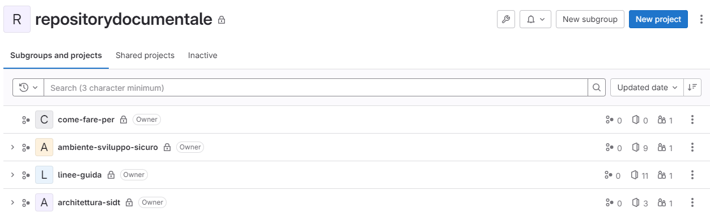

# Processo di Gestione della Documentazione

La gestione della documentazione all'interno del SIDT segue il paradigma  **Documentation as Code (DaC)**, in cui la documentazione viene trattata come parte integrante del ciclo di sviluppo software. Questo significa che, proprio come il codice sorgente, la documentazione viene versionata, aggiornata e rilasciata seguendo un flusso strutturato e tracciabile. L'intero processo è basato su **GitLab** come strumento centrale per la gestione dei requisiti relativi alla documentazione, dei file sorgenti e del ciclo di vita delle modifiche, mentre la documentazione aggiornata è disponibilie per la consultazione sul portale **Backstage**.

## Creazione della documentazione

La gestione della documentazione segue una struttura modulare in cui ogni tipologia di documentazione è organizzata in repository distinti su **GitLab** e successivamente integrata con **Backstage** per la visibilità centralizzata.

Di seguito vengono descritti i passaggi necessari per creare e gestire i repository della documentazione su GitLab e come integrarli in Backstage, distinguendo tra **Documentazione Generale**, **Documentazione Tecnica di Prodotto**, **Documentazione di Gestione delle Attività** e **Documentazione Tecnica della Componente**.

### Creazione del repository documentale su GitLab

#### Documentazione Generale

La **Documentazione Generale** copre aspetti trasversali come linee guida, architetture di riferimento, best practice, infrastruttura di erogazione e altre linee guida globali. Per ogni documento di questa categoria, si crea un **progetto GitLab separato**. Ogni progetto contiene un solo documento specifico e i file correlati.

I repository per la Documentazione Generale sono organizzati secondo lo schema illustrato in figura:



**Passaggi per creare il repository su GitLab**:

1. Accedi a **GitLab** e crea un nuovo **progetto** per ogni documento specifico (ad es. `linee-guida-sviluppo`, `architettura-riferimento`) nell'ambito del gruppo di competenza (`architettura-sidt`, `linee-guida`, `ambiente-sviluppo-sicuro` e `come-fare-per`).
2. Nella cartella principale del repository, crea un file `README.md` che descriva brevemente lo scopo del documento e la struttura del repository.
3. Crea la cartella `docs` nella root del repository e creare al suo interno un file denominato `index.md`
4. Crea un file **`catalog-info.yaml`** nella root del progetto. Questo file descrive l'entità del catalogo (ad esempio, un componente o una guida), specificando metadati e collegamenti alla documentazione.
5. Crea un file **`mkdocs.yml`** nella root del progetto. Questo file descrive la struttura della documentazione e i parametri di trasformazione da **Markdown** a **HTML** specificando metadati e collegamenti alla documentazione.
6. Effettua il primo commit e carica il contenuto sul repository.

**Esempio di struttura minima per la Documentazione Generale**:

```
/docs
  index.md
README.md
catalog-info.yaml
mkdocs.yml
```

**Esempio di configurazione del file `catalog-info.yaml` per la Documentazione Generale**:

```yaml
apiVersion: backstage.io/v1alpha1
kind: Component
metadata:
  name: "linee-guida-documentazione"
  description: "Linee guida per la redazione della documentazione"
  tags: 
    - doc-linee-guida
  annotations:
    backstage.io/techdocs-ref: dir:.
spec:
  type: service
  owner: user:username
  lifecycle: experimental
```

I tag ammessi nel campo `tags`, utilizzati per la classificazione automatica dei contenuti della documentazione, sono legati al gruppo di appartenenza del progetto e sono:

* doc-arch-sidt (architettura-sidt)
* doc-linee-guida (linee-guida)
* doc-env-developer (ambiente-sviluppo-sicuro)
* doc-how-to (come-fare-per)

La presenza di almeno un tag è obbligatoria ai fini della corretta gestione della Documentazione Generale. E' possibile attribuire più di un tag al documento.

**Esempio di configurazione del file `mkdocs.yml`**:

```yaml
site_name: "Linee guida per la redazione della documentazione"
site_description: Linee guida per la redazione della documentazione tecnica e di progetto nell'ambito del SIDT
plugins: 
    - techdocs-core
markdown_extensions: 
    - attr_list
nav:
    - Introduzione: "index.md"
    - Principi Fondamentali: "02-principi.md"
    - Strumenti e Tecnologie: "03-strumenti.md"
    - Struttura della Documentazione: "04-struttura.md"
    - Processo di Gestione della Documentazione: "05-processo.md"
    - Linee Guida di Scrittura: "06-scrittura.md"
    - Automazione e Integrazione: "07-automazione.md"
    - Versionamento e Gestione delle Modifiche: "08-versionamento.md"
    - Accessibilità e Distribuzione: "09-accessibilita.md"
    - Esempi e Template: "10-esempi.md"
    - Risorse addizionali: "11-risorse.md"
```

Il valore del campo `site_name` sarà utilizzato come titolo del documento, il valore del campo `site_description` costituisce il sottotitolo del codumento.

Il plugin `techdocs-core` è richiesto per l'integrazione con Backstage, altri plungin e extension possono essere aggiunti in ragione delle esigenze.

#### Documentazione Tecnica di Prodotto e Documentazione di Gestione delle Attività

La **Documentazione Tecnica di Prodotto** riguarda specifici prodotti software relativi a un particolare **Dominio di Business** nell'ambito del **Domain Driven Design** del SIDT.
La **Documentazione Tecnica di Prodotto** generalmente include documenti come **SRS**, **SDD**, **Test Plan**, **Guida all'installazione** e **Manuali Utente** in un modello di sviluppo **Waterfall**, mentre in un contesto **Agile** tende ad essere più ridotta ed efficace per l'approccio iterativo e si limita a **Scheda Progetto**, **Product Backlog** con le **User Stories** e le relative **Definition of Done**, **Technical Design Documents** e **Architecture Decision Records**.
Anche la **Documentazione di Gestione delle Attività** (piani di progetto, stati di avanzamento piuttosto che roadmap e sprint meeting report) è ospitata nello stesso progetto GitLab.
Tutta la documentazione relativa a un singolo prodotto è ospitata in un unico progetto GitLab.

**Passaggi per creare il repository su GitLab**:

1. Crea un progetto GitLab per il prodotto, ad esempio `emissione-patenti`.
2. Nella cartella principale del repository, crea un file `README.md` che descriva brevemente lo scopo del documento e la struttura del repository.
3. Crea la cartella `docs` nella root del repository e crea al suo interno un file denominato `index.md`
4. Crea un file **`catalog-info.yaml`** nella root del progetto. Questo file descrive l'entità del catalogo (in questo caso un sistema), specificando metadati e collegamenti alla documentazione.
5. Crea un file **`mkdocs.yml`** nella root del progetto. Questo file descrive la struttura della documentazione e i parametri di trasformazione da **Markdown** a **HTML** specificando metadati e collegamenti alla documentazione.
6. Organizza la documentazione in sottocartelle in base alla tipologia di documento (es. `/docs/srs`, `/docs/sdd`, `/docs/mng/piano`, `/docs/mng/sal`).
7. Crea ogni documento in formato **Markdown** o altro formato strutturato e salvalo nelle relative cartelle.
8. Configura le reference ai vari documenti nel file `mkdocs.yml` nella sezione `nav`
9. Effettua il primo commit e carica i file.

**Esempio di struttura per la Documentazione Tecnica di Prodotto**:

```
/docs
  /srs
    srs_emissione-patenti.md
  /sdd
    sdd_emissione-patenti.md
  /manuale_utente
    manuale_utente_emissione-patenti.md
  /installazione
    guida_installazione_emissione-patenti.md
README.md
catalog-info.yaml
mkdocs.yml
```

**Esempio di configurazione del file `catalog-info.yaml` per la Documentazione Generale**:

```yaml
apiVersion: backstage.io/v1alpha1
kind: Domain
metadata:
  name: "emissione-patente"
  description: "Bounded Context di Emissione Patenti"
  annotations:
    backstage.io/techdocs-ref: dir:.
spec:
  owner: user_group
  subdomainOf: patenti
```

**Esempio di configurazione del file `mkdocs.yml`**:

```yaml
site_name: "Emissione Patente"
site_description: Documentazione tecnica e di gestione delle attività del Dominio Emissione Patenti"
plugins: 
    - techdocs-core
markdown_extensions: 
    - attr_list
nav:
    - Emissione Patenti: "index.md"
    - Software Requirements Specification:
        - Utenti e Personas: "srs/personas.md"
        - Casi d'Uso: "srs/use-case.md"
        [... omissis ...]
        - Requisiti non funzionali: "srs/nfr.md"
        - Risorse addizionali: "srs/risorse.md"
    - Software Design Description:
        - Architettura Logica: "sdd/architettura-logica.md"
        - Modello del Dominio: "sdd/domain-model.md"
        [... omissis ...]
        - Struttura della base dati: "sdd/data-structure.md"
        - Risorse addizionali: "sdd/risorse.md"
    [... omissis ...]
    - Gestione Progetto:
        - Piano di Lavoro: "mng/piano/current.md"
        - Stati Avanzamento Lavori: "mng/sal/sal-report.md" # file che sintetizza l'avanzamento e referenzia i vari documenti di SAL
            - SAL 1: "mng/roadmap/sal-1.md"
            - SAL 2: "mng/roadmap/sal-2.md"
```

In un contesto **Agile** il file mkdoc.yml potrebbe comprendere una sezione relativa alla gestione degli Sprint:

```yaml
    - Sprint Management:
        - Sprint Planning: "mng/sprint/planning.md" # file che referenzia i vari sprint planning meeting report
        - Sprint Review: "mng/sprint/reviews.md" # file che referenzia i vari sprint review meeting report
        - Sprint Retrospective: "mng/sprint/retrospective.md" # file che referenzia i vari sprint retrospective meeting report
```

#### Documentazione Tecnica della Componente

La **Documentazione Tecnica della Componente** (ad es. microservizi, microfrontend o componenti infrastrutturali in un approccio IaC) viene ospitata nello stesso progetto GitLab che raccoglie la **codebase della componente**. La documentazione segue il ciclo di vita del codice sorgente e viene aggiornata in parallelo alle modifiche del codice.

**Passaggi per creare la documentazione tecnica della componente**:

1. Accedi al repository GitLab già esistente per la componente specifica (ad esempio, `microservizio_X` o `frontend_X`).
2. Crea una cartella `/docs` per la documentazione, ad esempio `/docs/api` per descrivere le API o `/docs/infrastruttura` per componenti IaC.
3. Scrivi i documenti in Markdown e organizza i file in sottocartelle.
4. Crea un file **`catalog-info.yaml`** nella root del progetto. Questo file descrive l'entità del catalogo (in questo caso una componente), specificando metadati e collegamenti alla documentazione.
5. Crea un file **`mkdocs.yml`** nella root del progetto. Questo file descrive la struttura della documentazione e i parametri di trasformazione da **Markdown** a **HTML** specificando metadati e collegamenti alla documentazione.
6. Effettua il commit delle modifiche e carica i file nel repository.

**Esempio di struttura per la Documentazione Tecnica della Componente**:

```
/src
  (codice del microservizio o della componente)
/docs
  /api
    documentazione_api.md
  /infrastruttura
    infrastruttura_iac.md
README.md
catalog-info.yaml
mkdocs.yml
```

**Esempio di configurazione del file `catalog-info.yaml` per la Documentazione Tecnica della Componente**:

```yaml
apiVersion: backstage.io/v1alpha1
kind: Component
metadata:
    name: microservizio_X
    description: Documentazione tecnica per il microservizio X
    tags:
    - microservice
    - API
    annotations:
        backstage.io/techdocs-ref: dir:.
spec:
    type: service
    owner: team-backend-X
    lifecycle: production
    system: sistema_X
    links:
    - url: 'https://gitlab..k8s01.sidt.local/domain/subdomain/microservizio_X/docs/api/documentazione_api.md'
        title: API Documentation

```

**Esempio di configurazione del file `mkdocs.yml`**:

```yaml
site_name: "Micoservizio X"
site_description: Documentazione tecnica del microservizio X
plugins: 
    - techdocs-core
markdown_extensions: 
    - attr_list
nav:
    - Microservizio X: "index.md"
        - Architettura: "architettura.md"
        - API: "api/documentazione_api.md"
        - Modello di Interazione: "use-case.md"
```

### Integrazione con Backstage

Backstage, una piattaforma open-source per la gestione centralizzata delle applicazioni e della documentazione, viene utilizzato per visualizzare e navigare attraverso la documentazione creata. Per integrare la documentazione con Backstage, occorre importare il componente all'interno di Backstage.

**Passaggi per importare il componente su Backstage**:

1. Accedi all'interfaccia di Backstage () e vai alla sezione **Catalog**.
2. Clicca su **"Register Existing Component"** e inserisci l'URL del file `catalog-info.yaml` presente nel repository GitLab.
   - Ad esempio: `https://gitlab..k8s01.sidt.local/project/microservizio_X/catalog-info.yaml`.
3. Backstage importerà automaticamente il repository e renderà disponibile la documentazione nella piattaforma.
4. Verifica che la documentazione sia correttamente visibile e navigabile.

## Coinvolgimento dei membri del team

Ecco il paragrafo **"Coinvolgimento dei membri del team"** nell'ambito del capitolo **"Processo di Gestione della Documentazione"**, basato sugli approcci tecnici e metodologici discussi in precedenza:

---

## Coinvolgimento dei membri del team

Il coinvolgimento attivo di tutti i membri del team nella creazione e manutenzione della documentazione è essenziale per garantire che i contenuti siano aggiornati, accurati e allineati allo sviluppo continuo del prodotto. La gestione della documentazione secondo il paradigma **Documentation as Code (DaC)** e l'uso di **GitLab** come strumento centrale per la gestione del versionamento e delle revisioni, facilitano un approccio collaborativo in cui ogni membro del team contribuisce alla qualità della documentazione.

### Ruoli e responsabilità

Nel processo di gestione della documentazione, è importante assegnare ruoli chiari e responsabilità ben definite ai membri del team:

- **Autori**: Membri del team responsabili della creazione e aggiornamento della documentazione. Gli autori possono essere sviluppatori, architetti o altri stakeholder che hanno competenze specifiche sul dominio trattato.
- **Revisori**: Membri del team incaricati di eseguire le **Code Review** delle modifiche alla documentazione tramite **Merge Request** su GitLab. Il loro compito è garantire che le informazioni siano tecnicamente accurate e che la documentazione rispetti le linee guida di stile e qualità.
- **Maintainers**: Persone o team responsabili della supervisione generale della documentazione, che si assicurano che sia sempre aggiornata e ben strutturata e approva la definita pubblicazione sul branch `master`. Sono anche i garanti dell'integrazione della documentazione con strumenti come **Backstage**.

### Processi collaborativi su GitLab

L'uso di **GitLab** per la gestione della documentazione facilita il coinvolgimento del team attraverso processi collaborativi basati su **Merge Request** (MR) e **Code Review**.

#### Creazione e aggiornamento tramite branch dedicati

- Ogni membro del team può creare un branch dedicato per una nuova sezione o aggiornamento della documentazione, seguendo il modello **GitFlow**. Ad esempio, per aggiornare la documentazione API di un microservizio, lo sviluppatore creerà un branch come `feature/update-api-docs`.
- Questa pratica promuove il contributo di ciascun membro senza interferire con il lavoro degli altri, e permette di mantenere la storia dei cambiamenti.

#### Revisione tramite Merge Request

- Una volta completata la modifica della documentazione, viene aperta una **Merge Request** su GitLab, in cui il membro del team descrive i cambiamenti e assegna revisori.
- I revisori esaminano i cambiamenti per assicurarsi che le informazioni siano accurate, che i formati siano corretti (ad esempio, Markdown) e che i contenuti siano chiari.
- Il processo di revisione e approvazione incoraggia il team a collaborare strettamente e a condividere la responsabilità della qualità della documentazione.

### Best practice per il coinvolgimento del team

Per assicurare il massimo coinvolgimento e una gestione ottimale della documentazione, è fondamentale adottare una serie di **best practice** che promuovano la collaborazione e la cura continua da parte di tutti i membri del team:

#### Includere la documentazione come parte delle Definition of Done (DoD)

- Ogni **User Story** o **Task** deve includere l'aggiornamento o la creazione della documentazione come parte integrante della **Definition of Done (DoD)**. Questo garantisce che la documentazione non venga trattata come un'attività secondaria, ma come un elemento fondamentale per il completamento del lavoro.
- Ad esempio, se viene sviluppata una nuova funzionalità API, la DoD dovrebbe specificare che la documentazione API deve essere aggiornata e validata prima che la funzionalità venga considerata completata.

#### Organizzare sessioni di revisione della documentazione

- Pianificare revisioni periodiche della documentazione (ad esempio, durante le **Sprint Review**) per assicurarsi che sia allineata con lo stato attuale del prodotto. Coinvolgere tutto il team in queste sessioni aiuta a identificare eventuali lacune o sezioni obsolete che necessitano di aggiornamenti.
- Queste revisioni favoriscono una responsabilità condivisa e incoraggiano il team a mantenere sempre aggiornata la documentazione, anche quando non direttamente legata a una singola funzionalità.

#### Utilizzare template e linee guida

- Utilizzare **template standard** per i vari tipi di documentazione (come SRS, SDD, API documentation) aiuta i membri del team a creare documenti coerenti e di alta qualità. I template riducono il tempo necessario per iniziare nuovi documenti e assicurano che tutti seguano le stesse linee guida.
- Le **linee guida di stile** per la documentazione (ad esempio, formattazione in Markdown, convenzioni di nomenclatura) presenti in questa linea guida dovrebbero essere condivise con tutto il team, in modo che ogni documento segua uno standard uniforme.

#### Feedback continuo

- Incoraggiare il team a fornire **feedback continuo** sulla documentazione durante il ciclo di sviluppo. Ad esempio, se un membro del team rileva che una sezione di un documento è poco chiara o obsoleta, può aprire una **issue** su GitLab per segnalare il problema e proporre un aggiornamento.
- Il coinvolgimento attivo e la possibilità di dare feedback aiuta a mantenere un ciclo di miglioramento continuo per la documentazione.

#### Integrazione della documentazione nel ciclo di sviluppo

- La documentazione deve essere integrata nel ciclo di sviluppo e visualizzabile attraverso strumenti come **Backstage**. Questo permette a tutti i membri del team di accedere facilmente alla documentazione aggiornata e di verificarne la correttezza direttamente dalla piattaforma.
- L'integrazione automatica degli agiornamenti alla documentazione con **Backstage** aiuta a mantenere la visibilità centralizzata e favorisce una maggiore cura nella sua gestione.

### Cultura della documentazione

Promuovere una **cultura della documentazione** all'interno del team è cruciale per assicurare che essa sia considerata una parte fondamentale del ciclo di sviluppo. La documentazione deve essere vista non solo come un dovere, ma come uno strumento di supporto che migliora la collaborazione e l'efficienza del team. Coinvolgere attivamente ogni membro del team nel processo di creazione, revisione e aggiornamento non solo aumenta la qualità della documentazione, ma ne garantisce anche la continua evoluzione in parallelo allo sviluppo del prodotto.

## Revisione e approvazione dei contenuti

La qualità della documentazione è garantita attraverso un processo strutturato di **revisione e approvazione**, gestito tramite **Merge Request** (MR) e **Code Review** su GitLab. Questo processo è fondamentale per mantenere la documentazione aggiornata, accurata e conforme agli standard di qualità, integrando il contributo attivo di più membri del team.

### Processo di revisione e approvazione su GitLab

L'intero ciclo di revisione e approvazione è integrato nel flusso di lavoro basato su GitLab, seguendo l'approccio **Documentation as Code (DaC)**, e utilizzando il modello **GitFlow** per il branching.

#### Creazione della Merge Request (MR)

- Ogni modifica o nuova aggiunta alla documentazione deve essere gestita tramite un **branch dedicato**, conforme alle convenzioni di GitFlow. Una volta completato il lavoro su quel branch, viene creata una Merge Request su GitLab.
- La Merge Request deve includere una descrizione dettagliata delle modifiche apportate alla documentazione, con riferimenti espliciti alle issue o alle User Stories correlate.
- La MR è lo strumento principale per avviare il processo di revisione e notificare automaticamente i revisori assegnati, assicurando la trasparenza delle modifiche e il loro tracciamento.

**Esempio di descrizione MR**:

```
Titolo: Aggiornamento della documentazione API per la gestione delle prenotazioni

Descrizione:
- Aggiunta documentazione per il nuovo endpoint `POST /prenotazioni`.
- Aggiornati i dettagli dei parametri di richiesta e le risposte.
- Corretti i codici di errore per l'endpoint `GET /prenotazioni`.

Issue correlata: #1234
```

#### Assegnazione dei revisori

- I revisori vengono assegnati al momento della creazione della Merge Request. Solitamente, i revisori sono membri esperti del team o persone responsabili della componente di prodotto o tecnologia correlata alla documentazione.
- Ogni revisore ha il compito di controllare i contenuti, verificare che siano corretti, completi e conformi alle **linee guida di stile** e qualità stabilite. I revisori devono anche verificare che la documentazione sia comprensibile per il target previsto e che segua le best practice di formattazione (ad esempio, Markdown per la leggibilità e la consistenza).

#### Revisione tecnica e validazione automatizzata

- Durante la revisione, il revisore può lasciare commenti direttamente nel contesto della Merge Request, evidenziando eventuali sezioni che necessitano di chiarimenti o modifiche.
- Se la documentazione include informazioni tecniche (ad esempio, API, infrastruttura, architettura), il revisore deve verificare la correttezza delle informazioni tecniche e assicurarsi che siano allineate con il codice sorgente e il comportamento del prodotto.

#### Correzioni e iterazioni

- Se vengono rilevati problemi o necessitano correzioni, il revisore può richiedere modifiche. Il creatore della Merge Request può quindi implementare i suggerimenti, effettuare nuovi commit e aggiornare la MR.
- Questo ciclo di feedback e revisione continua finché tutti i revisori non sono soddisfatti del risultato.

### Approccio collaborativo alla Code Review

Il processo di revisione dei contenuti non è solo una verifica tecnica, ma anche un'opportunità per favorire la collaborazione all'interno del team. Alcune best practice per garantire un approccio collaborativo e costruttivo includono:

#### Fornire feedback costruttivo

- Durante la revisione, è importante che i revisori forniscano feedback dettagliato e costruttivo. Commenti che spiegano chiaramente cosa è necessario correggere o migliorare aiutano l'autore della modifica a comprendere il contesto e ad applicare le modifiche in modo accurato.
- I revisori dovrebbero evidenziare non solo errori o omissioni, ma anche suggerimenti per migliorare la chiarezza e l'efficacia della documentazione.

#### Condivisione della responsabilità

- La responsabilità della qualità della documentazione è condivisa tra tutto il team, non solo dell'autore o del revisore. Ogni membro deve sentirsi coinvolto nel garantire che la documentazione sia mantenuta aggiornata e di alta qualità.
- La collaborazione attiva durante il processo di revisione crea un ciclo di feedback positivo, dove la documentazione diventa un patrimonio condiviso da tutto il team.

#### Utilizzare template per la revisione

- L'uso di **template di revisione** aiuta a uniformare il processo di feedback. I revisori possono seguire una checklist di punti da verificare, come la correttezza tecnica, la completezza dei contenuti, l'aderenza agli standard di formattazione e l'usabilità per il lettore.

### Approvazione e merge

#### Approvazione della Merge Request

- Una volta che tutti i revisori hanno esaminato e approvato la Merge Request, il processo di approvazione è completato. GitLab consente di configurare regole per le Merge Request, in modo che una MR non possa essere fusa senza l'approvazione di un numero predefinito di revisori.
- L'approvazione formale può avvenire con un semplice click sull'opzione "Approve" all'interno della Merge Request, garantendo che tutte le modifiche siano state verificate e accettate.

#### Merge nel branch principale

- Dopo l'approvazione, la modifica viene fusa nel branch principale (ad esempio, `develop` o `master`, a seconda del ciclo di sviluppo). Questo assicura che la documentazione aggiornata venga distribuita insieme alla versione del codice corrispondente.

#### Monitoraggio post-merge

- Dopo il merge, è buona pratica monitorare l'efficacia della documentazione pubblicata. Ad esempio, il team può raccogliere feedback dagli utenti interni o esterni per identificare eventuali miglioramenti da apportare nelle versioni successive.

### Best practice per la revisione e l'approvazione

Per garantire che il processo di revisione e approvazione sia efficace e coinvolga attivamente tutti i membri del team, è consigliabile adottare le seguenti **best practice**:

#### Definire chiaramente i criteri di revisione

- Stabilire **criteri di revisione** chiari aiuta a uniformare il processo. Ad esempio, i revisori dovrebbero verificare che i contenuti siano tecnicamente accurati, ben formattati, aderenti agli standard di stile e facili da comprendere per il target di riferimento.

#### Tempistiche per la revisione

- Impostare tempistiche chiare per la revisione è fondamentale per mantenere il flusso di lavoro agile. Le revisioni non dovrebbero ritardare eccessivamente il processo di sviluppo; un ciclo di revisione rapido ma approfondito consente di mantenere alto il ritmo e la qualità del lavoro.

#### Responsabilità distribuita

- Assicurarsi che il processo di revisione e approvazione non sia centralizzato su un numero ristretto di persone. Coinvolgere diversi membri del team nei ruoli di revisore consente una maggiore distribuzione della conoscenza e una visione più ampia su eventuali problemi o miglioramenti.s
