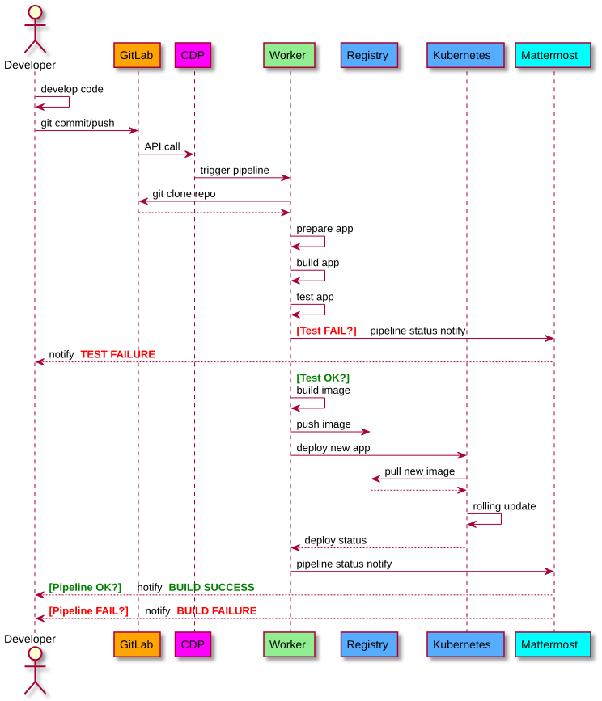
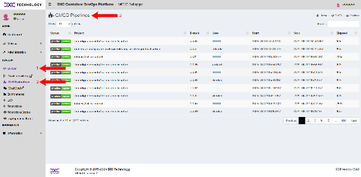
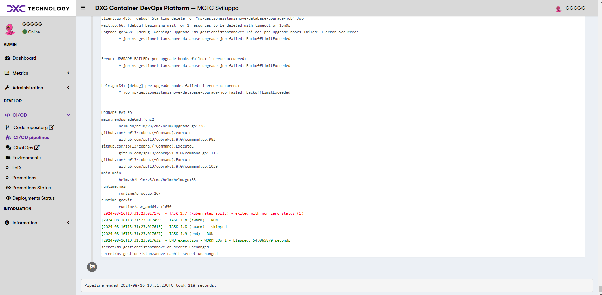

# Processo di Deploy in Ambiente di Sviluppo CDP

## Fasi del Processo di Deploy

L'ambiente di sviluppo descritto in questo documento utilizza la piattaforma CDP (Container DevSecOps Platform), una soluzione integrata progettata per gestire l'intero ciclo di vita delle applicazioni attraverso l'automazione e la containerizzazione. Il processo di deploy inizia con un evento di trigger configurato su GitLab, come un push o un tag sul repository. Questo attiva una pipeline CI/CD che gestisce automaticamente diverse fasi critiche:

1. **Scaricamento del Codice Sorgente**: La pipeline recupera il codice sorgente dal repository GitLab.
2. **Build dell'Applicazione**: Utilizzando Dockerfile e script specifici presenti nel repository, la piattaforma CDP costruisce l'immagine dell'applicazione.
3. **Test Automatici**: A questo punto, vengono eseguiti diversi tipi di test:
   1. **Test di Sicurezza**: Utilizzando strumenti appositi per **SAST** (*Static Application Security Testing*) e **DAST** (*Dynamic Application Security Testing*), il codice viene analizzato per identificare vulnerabilità di sicurezza.
   2. **Test di Qualità del Codice**: Implementati tramite SonarQube, per assicurare che il codice rispetti standard di qualità predefiniti.
   3. **Test Funzionali e di Regressione**: Questi includono test unitari con **JUnit** e test end-to-end con **Cerberus**, eseguiti automaticamente per verificare la corretta funzionalità dell'applicazione.
4. **Deploy sull'Ambiente di Sviluppo**: Se i test hanno esito positivo, l'immagine dell'applicazione viene rilasciata su un ambiente di sviluppo Kubernetes dedicato.
5. **Monitoraggio e Notifica**: Il risultato del processo di deploy, positivo o negativo, viene comunicato allo sviluppatore tramite un sistema di messaggistica configurato sulla CDP.

In caso di fallimento durante una delle fasi di test, la pipeline si interrompe, e l'errore viene notificato con dettagli specifici per il troubleshooting.

Nel diagramma di flusso seguente sono indicate le varie possibilità di progresso del deploy di uno sviluppo di codice nel flusso previsto dalla piattaforma CDP; per via della sua natura aperta alcuni specifici software (ad es. il registry, o lo strumento di chat) possono essere sostituiti da altri funzionalmente equivalenti.

## Integrazione con il Sistema di Controllo Qualità del Codice

La piattaforma CDP è integrata con vari strumenti di controllo qualità per garantire che ogni rilasciato soddisfi i requisiti di qualità definiti. L'integrazione con SonarQube permette il controllo continuo della qualità del codice sorgente, con l'impostazione di gate di qualità che devono essere superati prima di procedere alla fase successiva della pipeline.

## Integrazione con il Sistema di Controllo Sicurezza del Codice

Per garantire la sicurezza dell'applicazione durante il ciclo di vita del software, la CDP integra strumenti per l'analisi statica (SAST) e dinamica (DAST) del codice. Questa integrazione consente di identificare tempestivamente le vulnerabilità e di implementare piani di remediation automatici o manuali, in conformità con le politiche di sicurezza dell'organizzazione. Le vulnerabilità identificate vengono monitorate tramite una dashboard centralizzata, che facilita la gestione delle azioni correttive.

## Processo di Build

Il processo di build all'interno dell'ambiente CDP è progettato per essere riproducibile e sicuro. Utilizza immagini Docker come ambiente di build standardizzato, e tutti gli artefatti generati durante la build sono immagazzinati in registri sicuri (ad esempio, Harbor). Questo assicura che tutte le versioni del software possano essere tracciate e ripristinate se necessario.

È necessario che il codice contenuto non dipenda da configurazioni ottenute in fase di build, poiché questa fase viene eseguita solamente una volta \- il container ottenuto viene poi eventualmente promosso negli ambienti superiori, ma senza effettuare nuove operazioni di build. La configurazione necessaria deve essere presa dai file e dalle variabili d'ambiente concordate per il progetto.

## Deploy dei Container e del Database

Il deploy dei container e del database è gestito tramite script automatizzati all'interno della piattaforma CDP. I cambiamenti del database vengono eseguiti utilizzando Liquibase, che garantisce che tutte le modifiche siano coerenti e sincronizzate con il codice applicativo.

## Accesso alla dashboard delle pipeline in CDP

È possibile accedere dalla dashboard CDP al riepilogo delle pipeline eseguite:

Dalla lista, entrando nel dettaglio di una delle pipeline, è possibile accedere al log di esecuzione delle singole fasi, con eventuale evidenza di errori:

