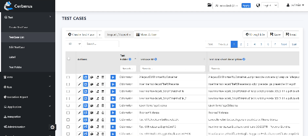
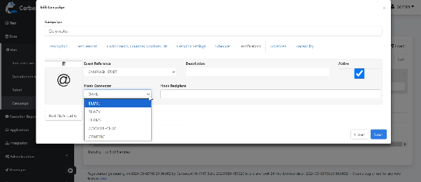
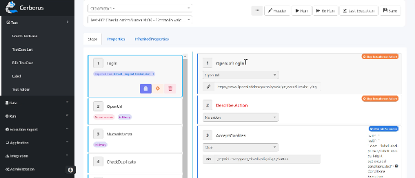

# Strumenti Selezionati

La selezione è stata effettuata sulla base delle necessità tecniche specifiche del contesto, garantendo l'integrazione con l'infrastruttura esistente e l'aderenza alle best practice di sicurezza e qualità del codice.

## Tool per i Test Unitari

Per l'esecuzione dei test unitari lato back-end, che includono microservizi e backend-for-frontend, si è optato per l'utilizzo di JUnit, un framework consolidato e ampiamente adottato per la scrittura e l'esecuzione di test unitari in ambienti Java. La selezione di JUnit è giustificata dalla sua robusta integrazione con gli ambienti di sviluppo, dalla sua affidabilità e dalla capacità di supportare le best practice di testing.

JUnit consente la definizione di casi di test mediante l'uso di annotazioni all'interno delle classi Java, strutturando i test in modo modulare e ripetibile. Le annotazioni come @Test sono utilizzate per indicare i metodi di test, mentre @Before e @After consentono di eseguire operazioni di setup e teardown rispettivamente prima e dopo ogni esecuzione di test.

Altro elemento chiave di JUnit è l'uso delle asserzioni, che servono a confrontare i risultati effettivi del codice in test con quelli attesi. Le asserzioni, tra cui ad esempio assertEquals(expected, actual) o assertTrue(condition), facilitano l'identificazione dei difetti nel codice testato, consentendo una diagnostica efficace e una rapida risoluzione dei problemi. Qualora un'asserzione fallisca, JUnit segnala l'errore e fornisce dettagli diagnostici che supportano il debug e la correzione del codice.

Il framework è progettato per integrarsi agevolmente con lo strumento di build previsto, Maven, nonché con gli ambienti di sviluppo integrati (IDE) come IntelliJ IDEA ed Eclipse. Questa integrazione supporta l'automazione dei test come parte del processo di build continuo, permettendo agli sviluppatori di eseguire e monitorare i test direttamente dall'ambiente di sviluppo, migliorando l'efficienza del ciclo di sviluppo.

La misurazione della copertura del codice, raccolta tramite apposito strumento, completa il quadro fornendo una valutazione della qualità del codice, evidenziando le aree non coperte dai test e individuando potenziali vulnerabilità di sicurezza. Tale approccio integrato assicura che il codice sia non solo funzionalmente robusto ma anche conforme agli standard di sicurezza e qualità previsti.

## Tool per i Test End-to-End

Per i test end-to-end l'amministrazione ha deciso di utilizzare Cerberus Testing. Cerberus è uno strumento specificamente progettato per eseguire test end-to-end, coprendo l'intero flusso applicativo, e risulta particolarmente adatto per applicazioni web.

Fornito delle opportune istanze di "robot" necessarie all'effettiva esecuzione dei test, Cerberus è in grado di scalare orizzontalmente per gestire carichi di diversa intensità ed anche di testare, se installate ed attivate, anche altre tipologie di applicazione (es. mobile, desktop client).

Il tool permette di automatizzare i test su diverse piattaforme, garantendo che ogni componente dell'applicazione funzioni correttamente e interagisca come previsto con le altre. Ogni rilascio su ambiente di collaudo viene sottoposto a test end-to-end automatizzati, assicurando che tutte le funzionalità dell'applicazione operino correttamente in un contesto reale.

Cerberus è un applicativo Java ospitato su application server Tomcat, ed ha un database MySql dedicato per la gestione dei casi di test. È possibile interagire con Cerberus tramite una webapp amministrativa e API REST, consentendo una facile integrazione con le pipeline CI/CD. Durante i test i browser Chrome e Firefox vengono eseguiti e pilotati in modalità headless, senza presentare le proprie finestre.

All'interno della web app di amministrazione sono presenti i moduli per la gestione dei casi, con una possibilità di organizzazione in cartelle e l'applicazione di etichette per ottenere dei raggruppamenti in campagne, una data library dedicata a contenere i volumi di dati da utilizzare nei casi di test, e le visualizzazioni delle esecuzioni dei test, sia pendenti che completate. È anche possibile definire più ambienti, impostare i vari parametri degli ambienti di esecuzione, ed accedere rapidamente alla documentazione di uso e di integrazione tramite API REST.

Cerberus è uno strumento low-code che rende possibile la stesura e la manutenzione dei casi di test non solo a sviluppatori ma anche ad analisti funzionali, così da permettere un più efficace allineamento tra i criteri di accettazione delle implementazioni ed i casi di test end-to-end che vanno a verificare la conformità del risultato con i criteri stessi. Dalla console web è anche possibile provare direttamente i test realizzati.

## Caratteristiche Principali

I tool selezionati condividono alcune caratteristiche chiave che ne garantiscono l'efficacia nell'ambiente di sviluppo sicuro:

* **Integrazione con GitLab e CI/CD**: Entrambi i tool, JUnit e Cerberus, si integrano perfettamente con GitLab, il sistema di gestione del codice sorgente utilizzato.
* **Compatibilità con gli strumenti di analisi di sicurezza**: Sebbene questo tipo di strumenti sia principalmente utilizzato per l'analisi statica del codice, i report di test generati da JUnit e Cerberus possono essere correlati con i risultati di sicurezza per una visione completa della qualità del codice e della sua sicurezza.
* **Supporto per Test Automatizzati**: Entrambi i tool supportano un elevato livello di automazione, elemento essenziale per mantenere un ciclo di sviluppo agile e continuo.

La scelta di JUnit e Cerberus come strumenti principali per i test nell'ambiente di sviluppo sicuro è stata guidata da diversi fattori; in primo luogo, entrambi i tool sono ampiamente utilizzati nell'industria e hanno dimostrato la loro affidabilità nel tempo. La loro maturità garantisce un supporto continuo e una vasta comunità di utenti, il che facilita la risoluzione di eventuali problemi e l'adozione di best practice.

La capacità di integrarsi con l'infrastruttura esistente, in particolare con GitLab e le pipeline CI/CD, è determinante. Infine, sia JUnit che Cerberus sono scalabili, consentendo di adattare l'ambiente di test in base alle esigenze specifiche dei diversi progetti. Questa flessibilità è cruciale per un ambiente di sviluppo che deve supportare molteplici applicazioni e team di sviluppo.
